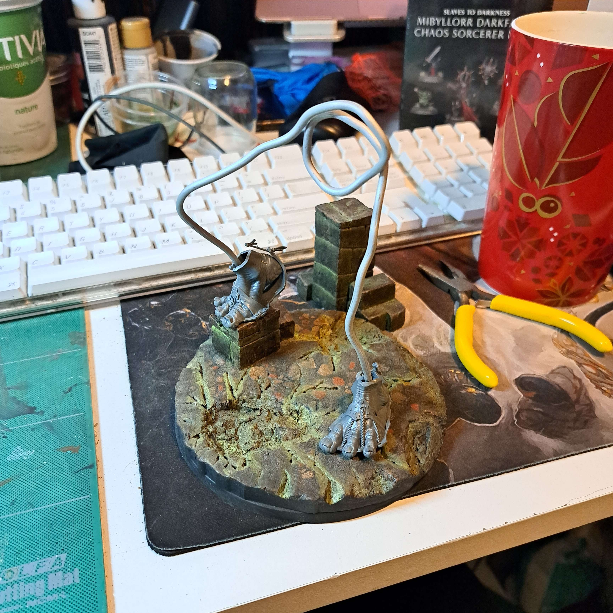

# Making a <sb>Gargant</sb>

<vi>How</vi> I kitbashed together another gargant from my leftover bits.

## Making a chaotic lad

The first step was to make a <vb>wire skeleton</vb>, which was fairly rough and twisted, but allowed me to pose him. Then came some tin foil to fill out forms. This stage was probably the hardest because I had never done this before.

After that, I started adding [milliput](https://www.google.com) plus the leftover gargant bits (head, arm, hand, feet). As I went I also added extra tinfoil in places with an immediate layer of `milliput` to keep it together.

`some code examples here`

---

[title](https://www.google.com)

### `Thinking` `about` the `base`

I want RUBBLE!
